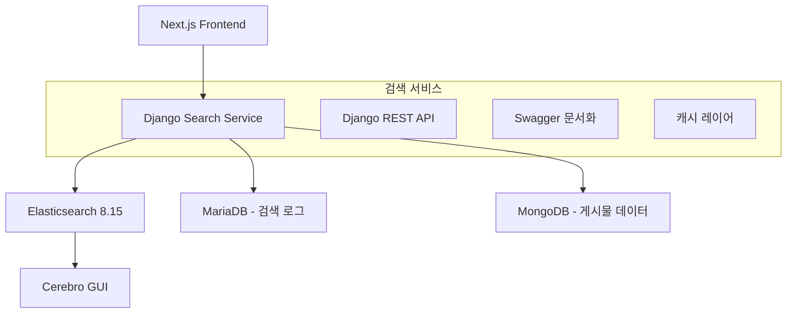

# 🔍 VansDevBlog Django-Elasticsearch 검색 서비스

> Django와 Elasticsearch를 기반으로 한 고성능 블로그 검색 마이크로서비스

##  프로젝트 개요

VansDevBlog의 마이크로서비스 아키텍처에 통합되는 Django-Elasticsearch 기반 검색 서비스입니다. 한국어와 영어 다국어 검색을 지원하며, 실시간 자동완성과 고급 필터링 기능을 제공합니다.

###  주요 기능

- ** 통합 검색**: 게시물, 카테고리, 태그 통합 검색
- ** 실시간 검색**: 타이핑 중 즉시 결과 표시
- ** 다국어 지원**: 한국어/영어 형태소 분석
- ** 자동완성**: 검색어 제안 및 추천
- ** 고급 필터링**: 카테고리, 날짜, 태그별 필터링
- ** 검색 분석**: 인기 검색어 및 사용자 패턴 분석

##  아키텍처



##  기술 스택

### 핵심 기술
- **Backend**: Django 5.1.5 + Django REST Framework 3.15.2
- **검색 엔진**: Elasticsearch 8.15.0 (Nori 한국어 분석기)
- **데이터베이스**: MariaDB (검색 로그) + MongoDB (게시물 데이터)
- **캐싱**: Django 내장 캐시 (비용 효율적)
- **문서화**: Swagger/OpenAPI (drf-yasg)

### 개발 도구
- **컨테이너**: Docker Compose
- **GUI 관리**: Cerebro (Elasticsearch 관리)
- **코드 품질**: Black, Flake8, isort
- **문서화**: PyDoc (Google 스타일)

##  빠른 시작

### 1. 환경 설정

```bash
# 저장소 클론
git clone <repository-url>
cd vans_devblog_django

# 가상환경 생성 및 활성화
python -m venv venv
venv\\Scripts\\activate  # Windows
# source venv/bin/activate  # macOS/Linux

# 의존성 설치
pip install -r requirements-minimal.txt
```

### 2. 환경 변수 설정

```bash
# .env 파일 생성 (예시 파일 복사)
copy .env.example .env  # Windows
# cp .env.example .env  # macOS/Linux

# .env 파일에서 필요한 설정 수정
```

### 3. Elasticsearch 시작

```bash
# Docker Compose로 Elasticsearch 및 Cerebro 시작
docker-compose up -d

# 상태 확인
docker-compose ps
```

### 4. Django 서버 실행

```bash
# 데이터베이스 마이그레이션
python manage.py migrate

# 개발 서버 시작
python manage.py runserver 8001
```

### 5. 서비스 확인

- **Django API**: http://localhost:8001/
- **Swagger 문서**: http://localhost:8001/swagger/
- **헬스체크**: http://localhost:8001/api/v1/search/health/
- **Elasticsearch**: http://localhost:9200/
- **Cerebro GUI**: http://localhost:9000/

## 📁 폴더더 구조

```
vans_devblog_django/
├──  문서
│   ├── README.md                                   # 이 파일
│   ├── Django-Elasticsearch-Search-Service-Plan.md # 구현 계획서
│   └── project_structure.md                       # 구조 문서
│
├──  Docker 설정
│   └── docker-compose.yml                         # ES + Cerebro
│
├──  Django 프로젝트
│   ├── vans_search_service/                       # 메인 설정
│   │   ├── settings.py                            # Django 설정
│   │   └── urls.py                                # URL 라우팅
│   └── search/                                    # 검색 앱
│       ├── views.py                               # API 뷰
│       ├── urls.py                                # 검색 URL
│       └── models.py                              # 데이터 모델
│
├── 데이터 & 로그
│   ├── db.sqlite3                                 # SQLite DB
│   └── logs/                                      # 로그 파일
│
└──  환경설정
    ├── .env                                       # 환경변수
    ├── .gitignore                                 # Git 제외외
    └── requirements-minimal.txt                   # Python 패키지
```

## 🔌 API 문서

### 헬스체크 API

```http
GET /api/v1/search/health/
```

**응답 예시:**
```json
{
  "status": "healthy",
  "service": "VansDevBlog Search Service",
  "version": "1.0.0",
  "elasticsearch_connected": true
}
```

### 전체 API 문서

Swagger UI에서 전체 API 문서를 확인할 수 있습니다:
- **Swagger UI**: http://localhost:8001/swagger/
- **ReDoc**: http://localhost:8001/redoc/

##  데이터베이스 설정

### MariaDB (검색 로그)
```sql
-- 검색 로그 테이블
CREATE TABLE search_logs (
    id BIGINT AUTO_INCREMENT PRIMARY KEY,
    user_id BIGINT,
    query VARCHAR(255) NOT NULL,
    results_count INT DEFAULT 0,
    search_time TIMESTAMP DEFAULT CURRENT_TIMESTAMP
);
```

### MongoDB (게시물 데이터)
기존 Post Service의 MongoDB 컬렉션을 사용하여 Elasticsearch와 동기화합니다.

##  개발 가이드

### 코드 스타일
- **PEP 8**: Python 표준 스타일 가이드 준수
- **PyDoc**: Google 스타일 docstring 사용
- **타입 힌팅**: Python 3.9+ 타입 어노테이션 필수

### 테스트 실행
```bash
# 전체 테스트 실행
python manage.py test

# 특정 앱 테스트
python manage.py test search
```

### 코드 품질 검사
```bash
# 코드 포맷팅
black .

# 린팅 검사
flake8

# import 정렬
isort .
```

##  성능 최적화

### 캐싱 전략
- **검색 결과**: 5분 캐시
- **자동완성**: 10분 캐시
- **인기 검색어**: 1시간 캐시

### Elasticsearch 설정
- **단일 노드**: 개발 및 소규모 운영 환경
- **Nori 분석기**: 한국어 형태소 분석
- **메모리**: 512MB 할당

##  모니터링

### 로그 확인
```bash
# 검색 서비스 로그
tail -f logs/search.log

# Django 개발 서버 로그
python manage.py runserver --verbosity=2
```

### Elasticsearch 모니터링
- **Cerebro**: http://localhost:9000/ - DBeaver와 유사한 GUI 도구
- **REST API**: http://localhost:9200/_cluster/health

## 기여 가이드

1. Fork the repository
2. Create a feature branch (`git checkout -b feature/amazing-feature`)
3. Commit your changes (`git commit -m 'Add amazing feature'`)
4. Push to the branch (`git push origin feature/amazing-feature`)
5. Open a Pull Request

## 라이선스

이 프로젝트는 MIT 라이선스 하에 배포됩니다. 자세한 내용은 `LICENSE` 파일을 참조하세요.

## 연락처

- **개발자**: VansDevBlog Team
- **이메일**: contact@vansdevblog.online
- **웹사이트**: https://vansdevblog.online